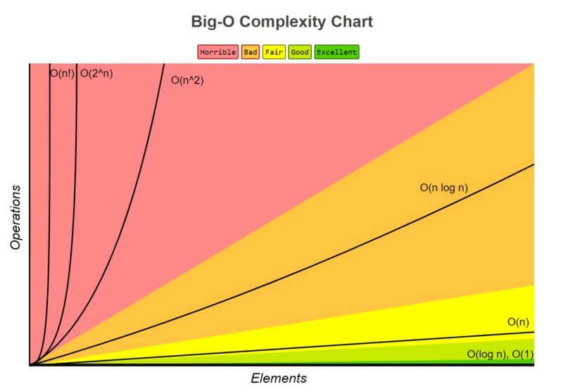

## Task 1 ## 
Write a function that adds a number passed to it to an internal sum and returns itself with its internal sum set to the new value, 
so it can be chained in a functional manner. Example of usage

## Example ##
```
sum(1) //1
sum(1)(2) //2
sum(1)(2)(3)(4)(5)(6)(7) //28
```

## Solution ##

The file with the solution to this task is called `closureSum.js`

## Task 2 ## 
Create a 'debounced' function that delays invoking function 
until after wait milliseconds have elapsed since the last time the debounced function was invoked.
The func is invoked with the last arguments provided to the debounced function.
Subsequent calls to the debounced function return the result of the last func invocation.

## Example ##
```
debounce(func, [wait=0])
```

## Solution ##

The file with the solution to this task is called `debounce.js`

## Task 3 ## 
Find length of array on which QuickSort starts working faster than BubbleSort.
You should implement sorts by your own.

For sorting use 3 types of arrays
- Sorted
- Sorted Backward
- With random placement of element

You can start with 2 elements and then increment number of element.

When you reach result, run it few times to check different random on arrays.
After you found result you can check few more length to compare how fast time growth on BubbleSort comparing to QuickSort.

## Solution ##

- Both **QuickSort** and **BubbleSort** are implemented in the sortingAlgorithms.js file.
- The file called `helpers.js` contains functions to return arrays in different formats (random, sorted, sorted backwards) and functions to compare time performance of algorithms. 
- The file called `algorithmsTestCases.js` contains the test cases for which BubbleSort performs worse than QuickSort.

## Task 4 ## 
For the following Θ-difficulties, write strict and non-strict O-limits and, optionally, strict and non-strict Ω-limits (provided that they exist).
1. Θ( 1 )
2. Θ( √n )
3. Θ( n )
4. Θ( n^2 )
5. Θ( n^3 )

## Solution ##

1. Θ(1)
- Strict O-limit: O(1)
- Strict Ω-limit: Ω(1)
- Non-strict O-limit: O(1)
- Non-strict Ω-limit: Ω(1)

2. 0(√n)
- Strict O-limit: O(√n)
- Strict Ω-limit: O(√n)

3. Θ(n)
- Strict O-limit: O(n)
- Strict Ω-limit: Ω(n)
- Non-strict O-limit: O(n)
- Non-strict Ω-limit: Ω(n)

4. Θ(n^2)
- Strict O-limit: O(n^2)
- Strict Ω-limit: Ω(n^2)

5. Θ(n^3)
- Strict O-limit: O(n^3)
- Strict Ω-limit: Ω(n^3)

## Graphs with common Time Complexities ##



