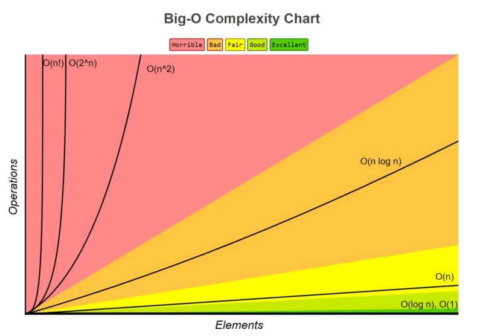

## Task 4 ## 
For the following Θ-difficulties, write strict and non-strict O-limits and, optionally, strict and non-strict Ω-limits (provided that they exist).
1. Θ( 1 )
2. Θ( √n )
3. Θ( n )
4. Θ( n^2 )
5. Θ( n^3 )

## Solution ##

1. Θ(1)
- Strict O-limit: O(1)
- Strict Ω-limit: Ω(1)
- Non-strict O-limit: O(1)
- Non-strict Ω-limit: Ω(1)

2. 0(√n)
- Strict O-limit: O(√n)
- Non-strict O-limit: O(√n)

3. Θ(n)
- Strict O-limit: O(n)
- Strict Ω-limit: Ω(n)
- Non-strict O-limit: O(n)
- Non-strict Ω-limit: Ω(n)

4. Θ(n^2)
- Strict O-limit: O(n^2)
- Non-strict O-limit: Ω(n^2)

5. Θ(n^3)
- Strict O-limit: O(n^3)
- Non-strict O-limit: Ω(n^3)

## Graphs with common Time Complexities ##

